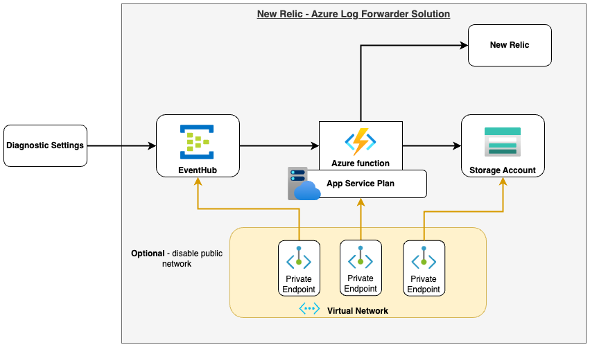
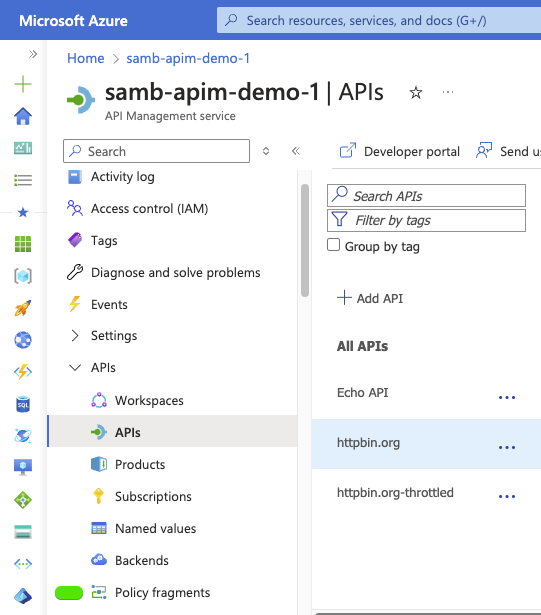
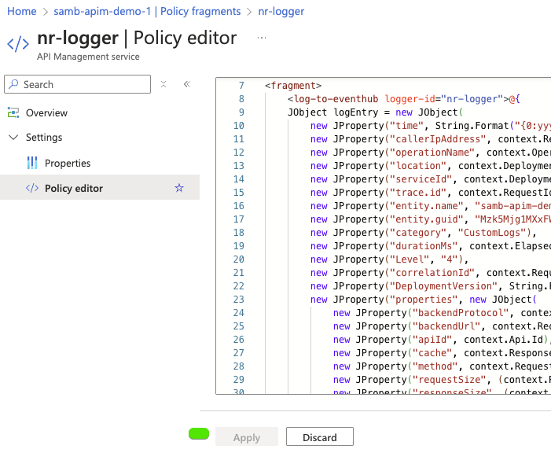
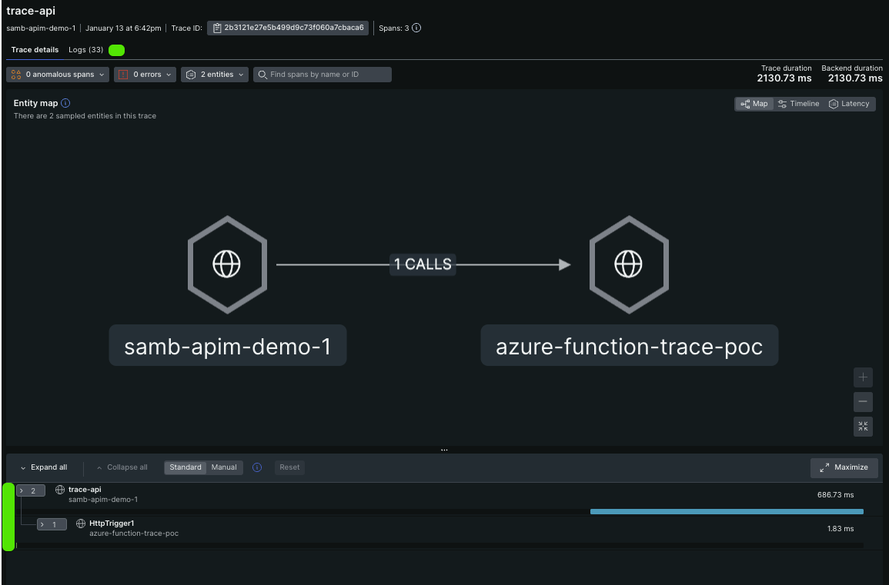

# [Experimental] - New Relic: Azure APIM Telemetry

# Overview

This is a guide for instrumenting an [Azure API Management](https://learn.microsoft.com/en-us/azure/api-management/api-management-key-concepts) with [New Relic](https://docs.newrelic.com/docs/new-relic-solutions/get-started/intro-new-relic/). 

> **Important**: The document contains `Experimental` code examples, that were setup as an example and is not production ready. 

In this guide will cover only the (Experimental) capabilities, rather than the Official capabilities. New Relic can be instrumented for Azure API Management to capture:

1. **Metrics (Official - supported)**: Use the [Azure Integration (Azure Monitor)](https://docs.newrelic.com/docs/infrastructure/microsoft-azure-integrations/get-started/activate-azure-integrations/)
1. **Diagnostic Settings (Official - supported)**: Use the Diagnostic Settings and push to the [Azure Log Forwarder solution](https://docs.newrelic.com/docs/logs/forward-logs/azure-log-forwarding/)
1. **Custom Logs (Experimental)**: Adds a policy fragment to capture custom logs and errors from Azure APIM.
1. **Distributed Tracing (Experimental)**: Tracks and observes service requests as they flow through distributed systems - [docs](https://docs.newrelic.com/docs/distributed-tracing/concepts/introduction-distributed-tracing/).
1. **Change Tracking**: New Relic supports publishing a [Change Tracking](https://docs.newrelic.com/docs/change-tracking/change-tracking-introduction/) event. If you've followed the `Traces (Experimental)` guide, it'll create an entity in New Relic, which changes can be published to. This will help track Infrastructure, CORs or other APIM level changes. 


## Guides

### Custom Logs (Experimental)

Azure Diagnostic Settings provide `Gateway` logs which contain quite a bit of information, but it's officially missing key data from an Application level and sometimes there's a need to generate more log information. This guide will cover how to setup an `APIM Fragmenet` to add to your `API Policy` which will create a Message that is published to our `Azure Log Forwarding Solution` (Eventhub > Function).

#### Setup

1. Create the [New Relic Azure log forwarder solution](https://docs.newrelic.com/docs/logs/forward-logs/azure-log-forwarding/) (if it doesn't already exist).
   <br>
1. Setup the event forwarder logger on APIM (using rest API): https://azure.github.io/apim-lab/apim-lab/6-analytics-monitoring/analytics-monitoring-6-3-event-hub.html.
  - An example script is provided here: `scripts/apim-logger-setup.sh`.
  Remember to update the variables and perform an `az login` before running the script.
1. Create an API Management Policy Fragment called `nr-logger`. <br><br>
   <br>
1. Copy the contents of the xml file `policies/fragment-full-details.xml` into the fragment and save it. <br><br>
   <br>
1. Select an API and add the `nr-logger` snippet to the `outbound` and `on-error` section of the policy. 
  ```xml
    <policies>
      <!-- Throttle, authorize, validate, cache, or transform the requests -->
      <inbound>
          <base />
      </inbound>
      <!-- Control if and how the requests are forwarded to services  -->
      <backend>
          <base />
      </backend>
      <!-- Customize the responses -->
      <outbound>
          <include-fragment fragment-id="nr-logger" />
          <base />
      </outbound>
      <!-- Handle exceptions and customize error responses  -->
      <on-error>
          <include-fragment fragment-id="nr-logger" />
          <base />
      </on-error>
    </policies>
  ```


##### Custom Logs - Details

After setting up the Policy Fragment you'll start seeing this data published:

```json
{
  "azure.forwardername": "EventHubForwarder",
  "azure.invocationid": "fd1e87da-cab3-4bde-b77c-c643dd8f5c6f",
  "callerIpAddress": "180.150.100.7",
  "category": "CustomLogs",
  "correlationId": "fa611412-c41f-4a27-98b8-20b583230a9b",
  "DeploymentVersion": "none/1",
  "durationMs": 207.77640000000002,
  "Level": "4",
  "location": "Australia East",
  "newrelic.source": "api.logs",
  "operationName": "/anything",
  "plugin.type": "azure",
  "plugin.version": "2.5.1",
  "properties.apiId": "httpbin-org-throttled",
  "properties.apimSubscriptionId": "master",
  "properties.backendMethod": "GET",
  "properties.backendProtocol": "https",
  "properties.backendResponseCode": 200,
  "properties.backendTime": 0,
  "properties.backendUrl": "https://httpbin.org/anything",
  "properties.cache": "none",
  "properties.clientProtocol": "https",
  "properties.method": "GET",
  "properties.operationId": "anything",
  "properties.requestSize": 0,
  "properties.responseCode": 200,
  "properties.responseSize": 427,
  "properties.url": "https://samb-apim-demo-1.azure-api.net/throttle/anything",
  "serviceId": "samb-apim-demo-1",
  "time": "2025-01-09T06:20:39.76Z",
  "timestamp": 1736403655429
}
```

This is great, but the cool thing is, you can customise this log message now for whatever your requirements are.  For more information on what's available in a Policy check the: [Microsoft Policy Expression Data - Context Variable](https://learn.microsoft.com/en-us/azure/api-management/api-management-policy-expressions).


### Custom Tracing (Experimental)

One challenges with Azure API Management is that Out Of the Box it only supports Azure Application Insights for tracing. This guide will walk through an `Experimental` approach to getting this data into New Relic and mapped to logs (if you are sending the custom logs from the previous guide).

#### Setup

1. Open the Azure Portal and find your API Management instance.
1. Go to the `Policy Fragement` page and create an API Management Policy Fragement called `nr-trace`.  <br><br>
   <br>
1. Open the file `policies/publish-trace.xml` and update line `35` with your New Relic [ingest key](https://docs.newrelic.com/docs/apis/intro-apis/new-relic-api-keys/) (create a new of if you need) and save the file.
1. Copy the contents of the xml file `policies/demo-trace.xml` into the fragment and save it. <br><br>
    <br>
1. Create a new policy fragmenet called `nr-trace-inbound` and add the contents of `policies/trace-inbound.xml`.
1. Select an API and add the `<include-fragment fragment-id="nr-trace-inbound" />` into the `inbound` and `<include-fragment fragment-id="nr-trace" />` into the `outbound` and `on-error` section of the policy: <br>
  ```xml
    <policies>
      <!-- Throttle, authorize, validate, cache, or transform the requests -->
      <inbound>
          <!-- Setups the Tracing variables to use later + traceparent header -->
          <include-fragment fragment-id="nr-trace-inbound" />
          <base />
      </inbound>
      <!-- Control if and how the requests are forwarded to services  -->
      <backend>
          <base />
      </backend>
      <!-- Customize the responses -->
      <outbound>
          <include-fragment fragment-id="nr-trace" />
          <include-fragment fragment-id="nr-logger" />
          <base />
      </outbound>
      <!-- Handle exceptions and customize error responses  -->
      <on-error>
          <include-fragment fragment-id="nr-logger" />
          <include-fragment fragment-id="nr-trace" />
          <base />
      </on-error>
    </policies>
  ```

#### New Relic View

After testing the setup, if you browse to the New Relic Portal, you should be able to see some distributed traces. If you also followd the `Custom Logs (Experimental)` Guide, it will have logs linked!


<br>

#### Implementation Notes

Using the fragment to POST the trace to New Relic is just for the pilot. To implement this properly we could:

1. Copy the Log Forwarder code but modify the payload requirements and POST url (from Logs > trace). 
1. Add a new eventhub to the existing New Relic namespace, so the traces can be processed along side the logs. This will decouple it from the APIM request.
1. In the traceparent header the `sample` is set to statically collect, which means it'll sample all requests, which can be a lot of data at scale.


## Support

There is no support for the content in this repository.

## Recognition

Recognition of the contribution to the logging component policy to [Clarence Bakirtzidis](https://www.linkedin.com/in/clarencebakirtzidis/) (Microsoft Global Black Belt).
