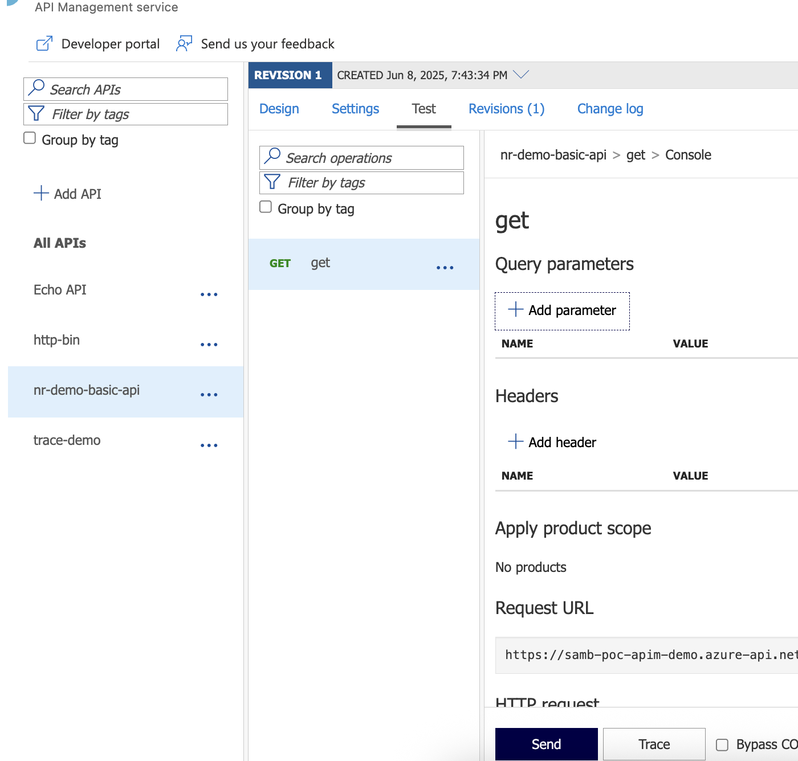

# [Experimental] - New Relic: Azure APIM Telemetry

# Overview

This is a guide for instrumenting an [Azure API Management](https://learn.microsoft.com/en-us/azure/api-management/api-management-key-concepts) with [New Relic](https://docs.newrelic.com/docs/new-relic-solutions/get-started/intro-new-relic/). 

> **Important**: The document contains `experimental` code samples, that are provided as an example. 

In this guide will cover only the `experimental` capabilities, rather than the Official capabilities. New Relic can be instrumented for Azure API Management to capture:

1. **Metrics (Official - supported)**: Use the [Azure Integration (Azure Monitor)](https://docs.newrelic.com/docs/infrastructure/microsoft-azure-integrations/get-started/activate-azure-integrations/)
1. **Diagnostic Settings (Official - supported)**: Use the Diagnostic Settings and push to the [Azure Log Forwarder solution](https://docs.newrelic.com/docs/logs/forward-logs/azure-log-forwarding/)
1. **Custom Logs (Experimental)**: Adds a policy fragment to capture custom logs and errors from Azure APIM.
1. **Distributed Tracing (Experimental)**: Tracks and observes service requests as they flow through distributed systems - [docs](https://docs.newrelic.com/docs/distributed-tracing/concepts/introduction-distributed-tracing/).
1. **Change Tracking**: New Relic supports publishing a [Change Tracking](https://docs.newrelic.com/docs/change-tracking/change-tracking-introduction/) event. If you've followed the `Traces (experimental)` guide, it'll create an entity in New Relic, which changes can be published to. This will help track Infrastructure, CORs or other APIM level changes. 


## Guides

### Custom Logs (Experimental)

Azure Diagnostic Settings provide `Gateway` logs which contain quite a bit of information, but it's missing key data from an Application level and sometimes there's a need to decorate or attach additional information. This guide will cover how to setup an `API Management - Policy Fragmenet` that can be added to your `API Policy` to define and publish a **Message** that is published to our `Azure Log Forwarding Solution` (Eventhub > Function).

#### Setup

Before starting, ensure you have an active New Relic account and create an [Ingest - License](https://docs.newrelic.com/docs/apis/intro-apis/new-relic-api-keys/) key. 

1. Create the [New Relic Azure log forwarder solution](https://docs.newrelic.com/docs/logs/forward-logs/azure-log-forwarding/) (if it doesn't already exist).
   <br>
1. Open the file `iac/apimSetup.bicep` (provided in this repository) and fill out the parameters.
1. Deploy the Bicep module to the `resource group` where APIM is deployed to. <br> <br> Do this via the Azure Portal, AZ CLI or PowerShell.
    ```PowerShell
      ## Run the Connect-AzAccount prior to ensure it's logged in
      New-AzResourceGroupDeployment -Name 'apim-setup' -ResourceGroupName "INSERT_RG_NAME" -TemplateFile ./iac/apimSetup.bicep 
    ```
    <br>
1. Select an API and add the `nr-logger` snippet to the `outbound` and `on-error` section of the policy. 
  ```xml
    <policies>
      <!-- Throttle, authorize, validate, cache, or transform the requests -->
      <inbound>
          <base />
      </inbound>
      <!-- Control if and how the requests are forwarded to services  -->
      <backend>
          <base />
      </backend>
      <!-- Customize the responses -->
      <outbound>
          <!-- Create a payload to post to the eventhub logger -->
          <include-fragment fragment-id="nr-logger" />
          <base />
      </outbound>
      <!-- Handle exceptions and customize error responses  -->
      <on-error>
          <!-- Create a payload to post to the eventhub logger -->
          <include-fragment fragment-id="nr-logger" />
          <base />
      </on-error>
    </policies>
  ```


##### Custom Logs - Details

After setting up the Policy Fragment you'll start seeing this data published (EXAMPLE Below):

```json
{
  "azure.forwardername": "EventHubForwarder",
  "azure.invocationid": "fd1e87da-cab3-4bde-b77c-c643dd8f5c6f",
  "callerIpAddress": "180.150.100.7",
  "category": "CustomLogs",
  "correlationId": "fa611412-c41f-4a27-98b8-20b583230a9b",
  "DeploymentVersion": "none/1",
  "durationMs": 207.77640000000002,
  "level": "DEBUG",
  "location": "Australia East",
  "newrelic.source": "api.logs",
  "operationName": "/anything",
  "plugin.type": "azure",
  "plugin.version": "2.5.1",
  "properties.apiId": "httpbin-org-throttled",
  "properties.apimSubscriptionId": "master",
  "properties.backendMethod": "GET",
  "properties.backendProtocol": "https",
  "properties.backendResponseCode": 200,
  "properties.backendTime": 0,
  "properties.backendUrl": "https://httpbin.org/anything",
  "properties.cache": "none",
  "properties.clientProtocol": "https",
  "properties.method": "GET",
  "properties.operationId": "anything",
  "properties.requestSize": 0,
  "properties.responseCode": 200,
  "properties.responseSize": 427,
  "properties.url": "https://samb-apim-demo-1.azure-api.net/throttle/anything",
  "serviceId": "samb-apim-demo-1",
  "time": "2025-01-09T06:20:39.76Z",
  "timestamp": 1736403655429
}
```

This is great, but the cool thing is, you can customise this log message now for whatever your requirements are.  For more information on what's available in a Policy check the: [Microsoft Policy Expression Data - Context Variable](https://learn.microsoft.com/en-us/azure/api-management/api-management-policy-expressions).


### Custom Tracing (Experimental)

One challenges with Azure API Management is that Out Of the Box it only supports Azure Application Insights for tracing. This guide will walk through an `Experimental` approach to getting this data into New Relic and mapped to logs (if you are sending the custom logs from the previous guide).

#### Setup

1. Open the file `iac/apimSetup.bicep` and fill out the parameters.
1. Deploy the Bicep module to the `resource group` where APIM is deployed to. 
  1. Do this via the Azure Portal, AZ CLI or PowerShell. <br>
    ```PowerShell
    ## Run the Connect-AzAccount prior to ensure it's logged in
    New-AzResourceGroupDeployment -Name 'apim-setup' -ResourceGroupName "INSERT_RG_NAME" -TemplateFile ./iac/apimSetup.bicep 
    ```
    <br>
1. Select an API and add the `<include-fragment fragment-id="nr-trace-inbound" />` into the `inbound` and `<include-fragment fragment-id="nr-trace" />` into the `outbound` and `on-error` section of the policy: <br>
  ```xml
    <policies>
      <!-- Throttle, authorize, validate, cache, or transform the requests -->
      <inbound>
          <!-- Setups the Tracing variables to use later + traceparent header -->
          <include-fragment fragment-id="nr-trace-inbound" />
          <base />
      </inbound>
      <!-- Control if and how the requests are forwarded to services  -->
      <backend>
          <base />
      </backend>
      <!-- Customize the responses -->
      <outbound>
           <!-- Publishes a trace to NR directly -->
          <include-fragment fragment-id="nr-trace-publish" />

          <!-- Create a payload to post to the eventhub logger -->
          <include-fragment fragment-id="nr-logger" />
          <base />
      </outbound>
      <!-- Handle exceptions and customize error responses  -->
      <on-error>
          <!-- Create a payload to post to the eventhub logger -->
          <include-fragment fragment-id="nr-logger" />

          <!-- Publishes a trace to NR directly -->
          <include-fragment fragment-id="nr-trace-publish" />
          <base />
      </on-error>
    </policies>
  ```

#### New Relic View

After testing the setup, if you browse to the New Relic Portal, you should be able to see some distributed traces. If you also followed the `Custom Logs (Experimental)` guide, it will have logs linked!


<br>

#### Demo

This repo comes with a demo API deployable via a bicep. To deploy the demo:

1. Ensure you have the Azure Log Forwarder deployed. 
1. Fill out the parameters in the `apimSetup.bicep` module then deploy it.
1. Deploy the `demoApi.bicep` module. 

This will provision a demo api called `nr-demo-basic-api` which will publish logs & traces to New Relic.



#### Implementation Notes

Using the API Management `policy fragment` to POST the trace to New Relic is just for the pilot. To implement this properly we could:

1. Copy the Log Forwarder code but modify the payload requirements and POST url (from Logs > trace). 
1. Add a new eventhub to the existing New Relic namespace, so the traces can be processed along side the logs. This will decouple it from the APIM request.
1. In the traceparent header the `sample` is set to statically collect, which means it'll sample all requests, which can be a lot of data at scale.


## Support

There is no support for the content in this repository.

## Recognition

Recognition of the contribution to the logging component policy to [Clarence Bakirtzidis](https://www.linkedin.com/in/clarencebakirtzidis/) (Microsoft Global Black Belt).
